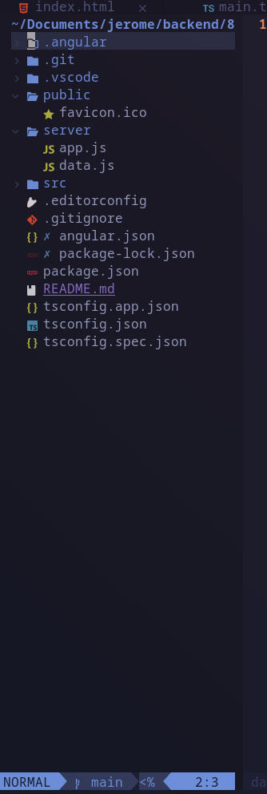
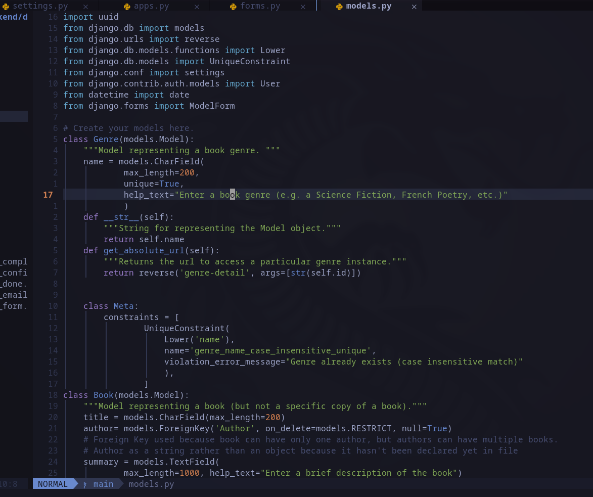
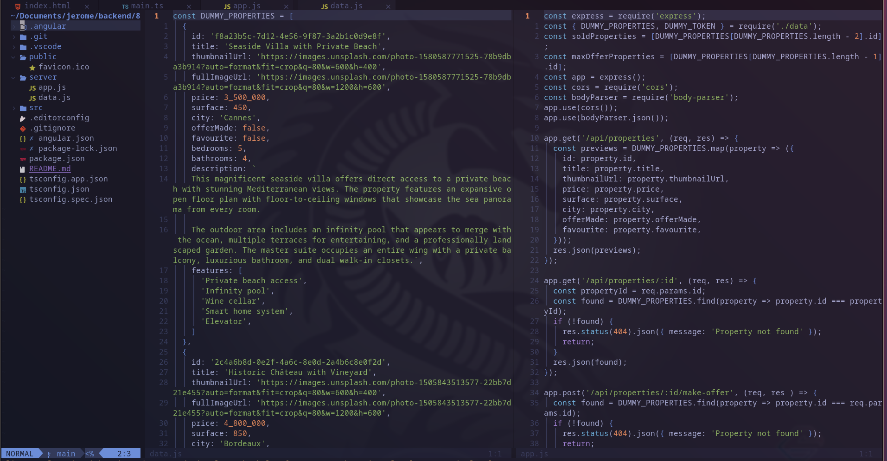
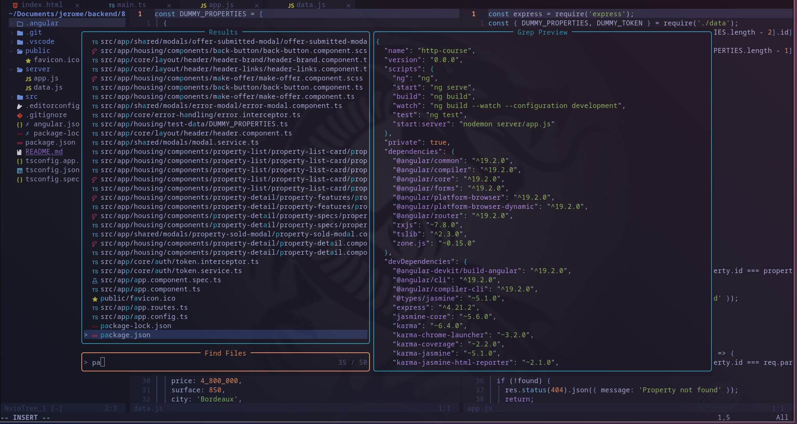
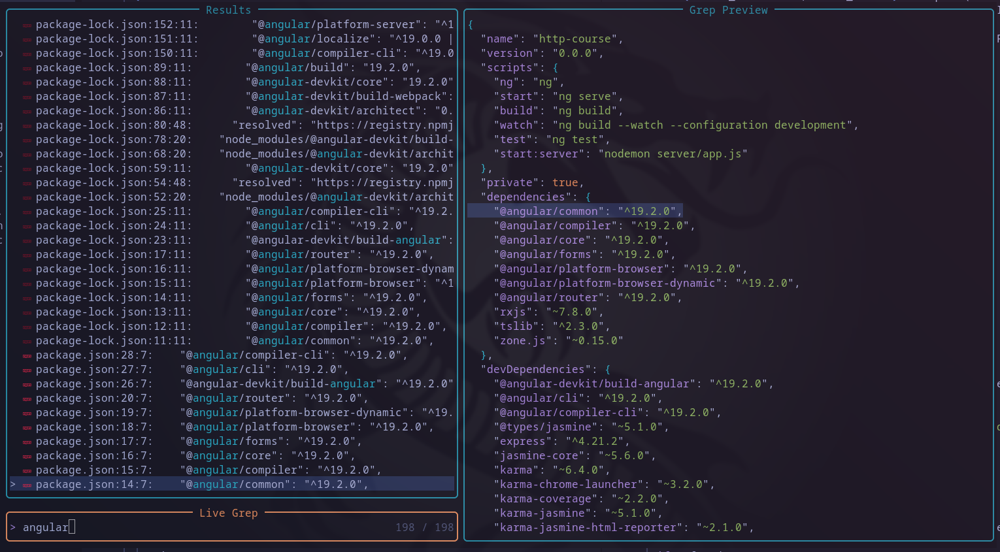

# 🚀 Modern Neovim IDE Config

A modular, fast, and aesthetics-focused Neovim configuration built with **Neovim** and **Lazy.nvim**.

This setup transforms Neovim into a **modern, dynamic IDE** — inspired by VS Code ergonomics — while preserving speed, hackability, and philosophy.

It includes:

✅ VS Code-like sidebar & terminal behavior
✅ Smooth animations
✅ AI assistance
✅ Modern UI components
✅ Advanced navigation & search
✅ Python-ready IDE workflow

---



---

## 🛠️ Features

### ⚡ Core IDE Experience

* **Plugin Manager**: [Lazy.nvim Guide](https://github.com/folke/lazy.nvim) — ultra-fast startup & lazy loading
* **LSP Integration** — IDE-style diagnostics, navigation & refactoring
* **Python Support** via Pyright ([Pyright Docs](https://github.com/microsoft/pyright))

---

### 🔍 Advanced Navigation

Powered by [Telescope.nvim](https://github.com/nvim-telescope/telescope.nvim)

* Fuzzy file search
* Live grep
* Buffer navigation
* Recent files

---

### 🧠 AI Coding Assistant

Integrated [GitHub Copilot](https://docs.github.com/copilot)

* Inline suggestions
* Smart acceptance keymaps
* Safe lazy loading

---

### 🎨 Modern UI System

* [TokyoNight Theme](https://github.com/folke/tokyonight.nvim)
* Dashboard welcome screen
* Dynamic statusline
* Buffer tabs
* Scroll animations
* Git indicators
* Treesitter highlighting & smart indentation
* Autopairs
* Keymap helper popups

---

### 📁 Sidebar & Terminal

* [nvim-tree.lua](https://github.com/nvim-tree/nvim-tree.lua) → adaptive sidebar with icons & git info
* [toggleterm.nvim](https://github.com/akinsho/toggleterm.nvim) → floating or bottom terminal sessions

---

### 🧬 Syntax Intelligence

Powered by [nvim-treesitter](https://github.com/nvim-treesitter/nvim-treesitter)

* Modern highlighting
* Incremental selection
* Indentation awareness

---










---

# 📚 Documentation & Learning

This configuration is meant to be **learnable and hackable**.

* Core editor: [Neovim API Documentation](https://neovim.io/doc/)
* Plugin manager: [Lazy.nvim Guide](https://github.com/folke/lazy.nvim)
* Search & navigation: [Telescope Docs](https://github.com/nvim-telescope/telescope.nvim)
* Syntax engine: [Treesitter Docs](https://github.com/nvim-treesitter/nvim-treesitter)
* File explorer: [nvim-tree Docs](https://github.com/nvim-tree/nvim-tree.lua)
* Terminal manager: [ToggleTerm Docs](https://github.com/akinsho/toggleterm.nvim)
* AI assistant: [Copilot Docs](https://docs.github.com/copilot)

---

# 📦 Prerequisites (Cross-Platform)

## 🐧 Linux

### Arch Linux

```bash
sudo pacman -S neovim ripgrep fd git
```

### Fedora

```bash
sudo dnf install neovim ripgrep fd-find git
```

### Debian / Ubuntu

```bash
sudo apt install neovim ripgrep fd-find git
```

---

## 🪟 Windows — Beginner Friendly (GUI First)

Use the official installers:

* [Neovim Installer](https://neovim.io/download/)
* [Git for Windows](https://git-scm.com/download/win)
* [ripgrep Releases](https://github.com/BurntSushi/ripgrep/releases)
* [fd Releases](https://github.com/sharkdp/fd/releases)

Download → run installer → accept defaults.

---

### PowerShell Alternative (Advanced Users)

```powershell
winget install Neovim.Neovim Git.Git BurntSushi.ripgrep sharkdp.fd
```

---

Python LSP:

```bash
npm install -g pyright
```

(Requires [Node.js](https://nodejs.org/))

---

# 🚀 Installation

[Click to clone the repository](https://github.com/monamijer/nvim-conf)

### Linux / macOS

```bash
git clone https://github.com/monamijer/nvim-conf.git ~/.config/nvim
```

### Windows

```powershell
git clone https://github.com/monamijer/nvim-conf.git %LOCALAPPDATA%\nvim
```

Launch:

```bash
nvim
```

Plugins install automatically on first run.

---

# ⌨ Keybindings Overview

Leader key → **Space**

### Navigation

| Key          | Action         |
| ------------ | -------------- |
| `<leader>ff` | Find files     |
| `<leader>fg` | Live grep      |
| `<leader>fw` | Search word    |
| `<leader>fb` | Buffers        |
| `<C-b>`      | Sidebar toggle |

### LSP

| Key          | Action           |
| ------------ | ---------------- |
| `gd`         | Go to definition |
| `K`          | Hover docs       |
| `<leader>rn` | Rename symbol    |
| `<leader>ca` | Code actions     |

### Terminal

| Key                   | Action          |
| --------------------- | --------------- |
| `<C-\>` / `<leader>t` | Toggle terminal |

### Editing

| Key               | Action                    |
| ----------------- | ------------------------- |
| `<C-s>`           | Save                      |
| `<C-z>` / `<C-y>` | Undo / redo               |
| `<M-l>`           | Accept Copilot suggestion |

---

# 📂 Project Structure

```
~/.config/nvim/
├── init.lua
├── lazy-lock.json
├── coc-settings.json
├── README.md
├── LICENSE
├── screenshots/
└── lua/
      ├── core/
      │   ├── keymaps.lua
      │   ├── options.lua
      └── plugins/
          ├── ui.lua
          ├── lsp.lua
          └── utils.lua
```

---

# 🐛 Support & Troubleshooting

Inside Neovim run:

```bash
:Lazy sync
:checkhealth
```

If issues persist:

* Update Neovim
* Reinstall dependencies
* Clear plugin cache

Report issues / request help: [GitHub Issues](https://github.com/monamijer/nvim-conf/issues)

Include:

* OS
* Neovim version
* Error messages

---

# 🤝 Contributing

Contributions welcome!

1. Fork the repository
2. Create a feature branch
3. Commit changes
4. Push
5. Open a pull request

Bug fixes, documentation improvements, and ideas are appreciated.

---

# 📜 License & Copyright

This project is open source under the repository license. See: LICENSE (included)

---

# ✨ Philosophy

This configuration merges:

⚡ Neovim performance
🎨 modern IDE aesthetics
🧠 developer intelligence
🚀 ergonomic workflow

while staying:

✔ modular
✔ hackable
✔ beginner-friendly
✔ cross-platform

Make it yours. Learn from it. Extend it.

---

Enjoy hacking your editor 🚀
